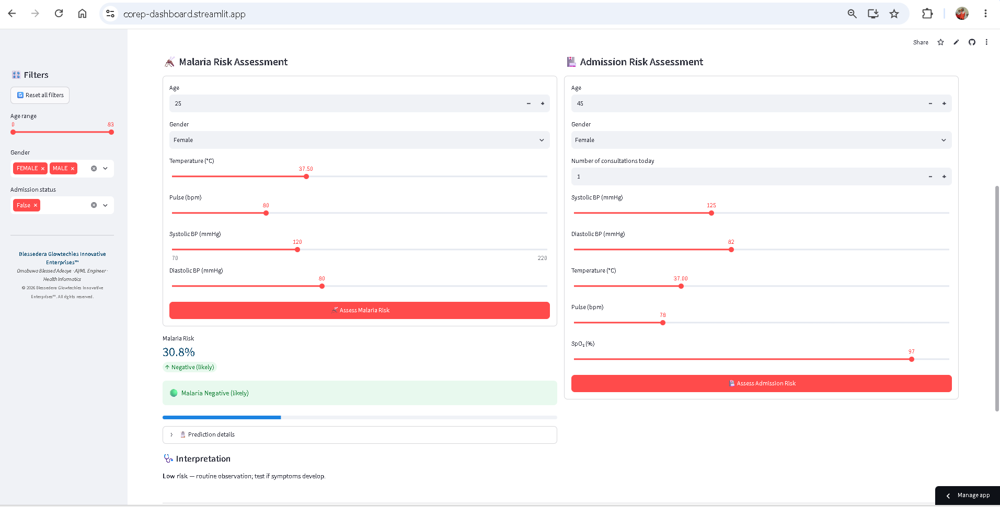
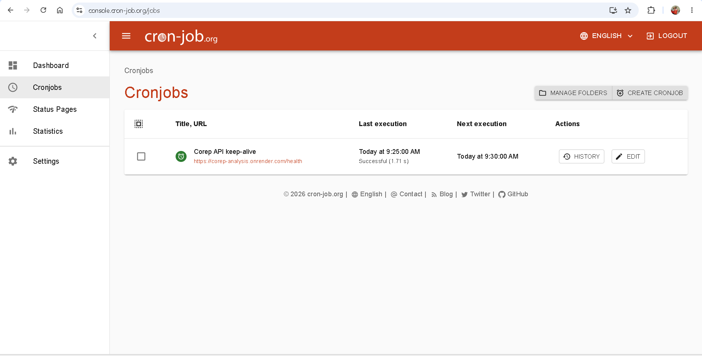

# 🏥 COREP Outreach Analytics

> An end-to-end healthcare analytics platform for annual medical outreach programs — data ingestion, EDA, forecasting, clustering, NLP, ML, reporting, an interactive dashboard, and a REST API.

---

---

## 🌐 Live Deployments

| Service                           | URL                                                                                      | Description                                                  |
| --------------------------------- | ---------------------------------------------------------------------------------------- | ------------------------------------------------------------ |
| 📊**Interactive Dashboard** | [corep-dashboard.streamlit.app](https://corep-dashboard.streamlit.app)                      | Full-featured Streamlit app with filters, 46+ charts, 9 tabs |
| 🖼️**Charts Gallery**      | [blessed1adeoye.github.io/corep_analysis](https://blessed1adeoye.github.io/corep_analysis/) | Static gallery of all 45+ charts                             |
| 🚀**REST API**              | [corep-analysis.onrender.com](https://corep-analysis.onrender.com)                          | ML predictions via FastAPI                                   |
| 📚**API Docs**              | [corep-analysis.onrender.com/docs](https://corep-analysis.onrender.com/docs)                | Interactive Swagger documentation                            |

### 🔮 Clinical Decision Support

*Real-time malaria and admission risk predictions, powered by the live FastAPI backend.*

## ✨ Features

### 📊 Interactive Streamlit Dashboard

- **9 tabs** covering Demographics, Consultations, Lab Tests, Optical, Pharmacy, Vitals, Trends, and Data Tables
- **46+ interactive charts** powered by Plotly
- **Live filters** for age, gender, admission status
- **PII-safe**: patient bio-data is stripped from all tables
- **Mobile-responsive**: works on phones, tablets, desktops
- **Password-gated**: only authorized staff can access

### 📈 Data Analysis Pipeline

- **Automated EDA** across 7 data sources (Patients, Consultations, Nursing, Lab, Optical, Pharmacy, Drugs)
- **Clinical Q&A**: answers 7 predefined clinical questions with charts
- **Patient Clustering**: K-Means with elbow + silhouette analysis
- **NLP on clinical text**: word clouds, n-grams, symptom co-occurrence
- **Annual forecasting**: year-over-year trends + peak-hour intraday analysis

### 📄 Report Generation

- **Word report**: landscape A4, 0.5" margins, 22 branded full-page charts
- **Responsive HTML report**: mobile-first, embedded base64 charts
- **Excel exports**: branded with header rows

### 🤖 Machine Learning

- **Admission prediction**: 3 models compared (Logistic Regression, Random Forest, Gradient Boosting)
- **Malaria risk prediction**: same 3-model approach
- **ROC curves + feature importance** auto-generated
- **Auto-upgrade**: switches from heuristic to trained mode when 2+ years of data available

### 🚀 FastAPI REST Service

- `/predict/admission` — predicts admission likelihood
- `/predict/malaria` — predicts malaria positivity
- Heuristic fallback so it works even without trained models
- Interactive Swagger UI at `/docs`

### 🔄 Always-On Reliability

*The API is kept warm by a 5-minute health check via cron-job.org — no cold starts, ever.*

---

## 🛠️ Tech Stack

| Layer                   | Technology                                    |
| ----------------------- | --------------------------------------------- |
| **Data**          | pandas, numpy, openpyxl                       |
| **Visualization** | matplotlib, seaborn, Plotly                   |
| **ML**            | scikit-learn, Prophet, statsmodels            |
| **NLP**           | NLTK, wordcloud, scikit-learn TfidfVectorizer |
| **Reporting**     | python-docx, Jinja2, WeasyPrint (optional)    |
| **Dashboard**     | Streamlit                                     |
| **API**           | FastAPI, uvicorn, pydantic                    |
| **Deployment**    | Streamlit Cloud, GitHub Pages                 |

---
